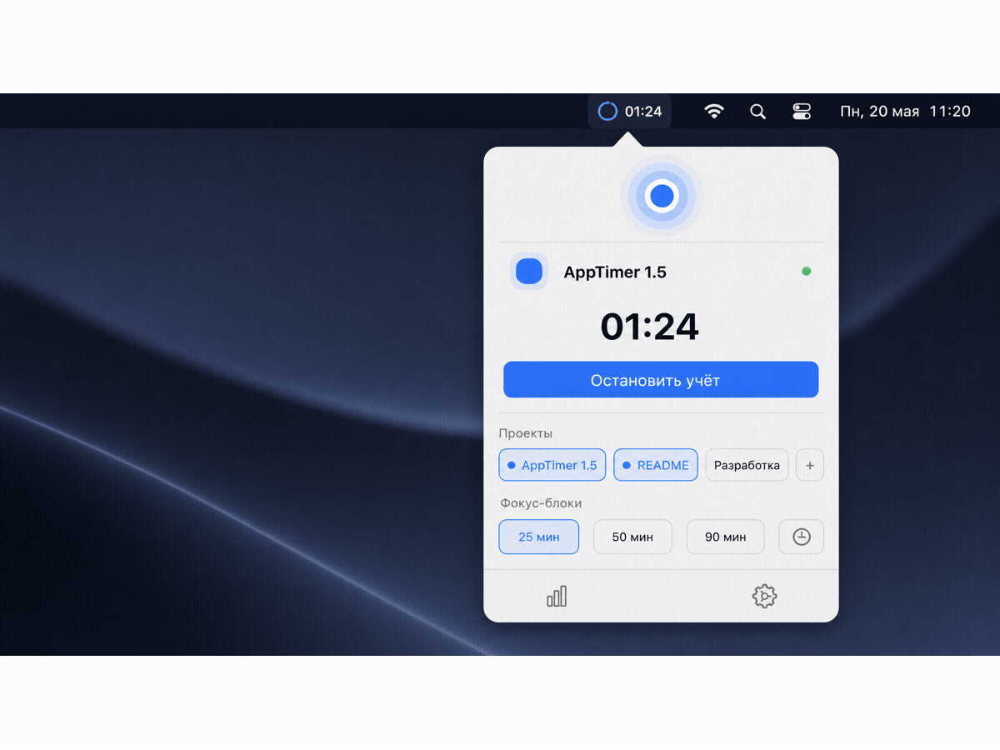
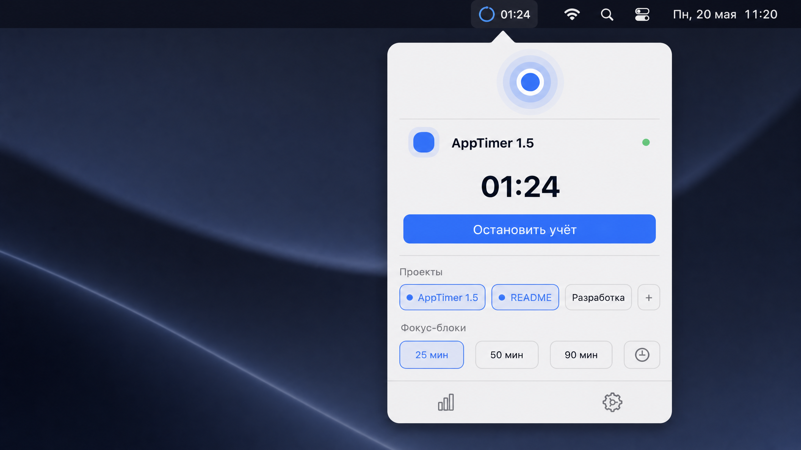
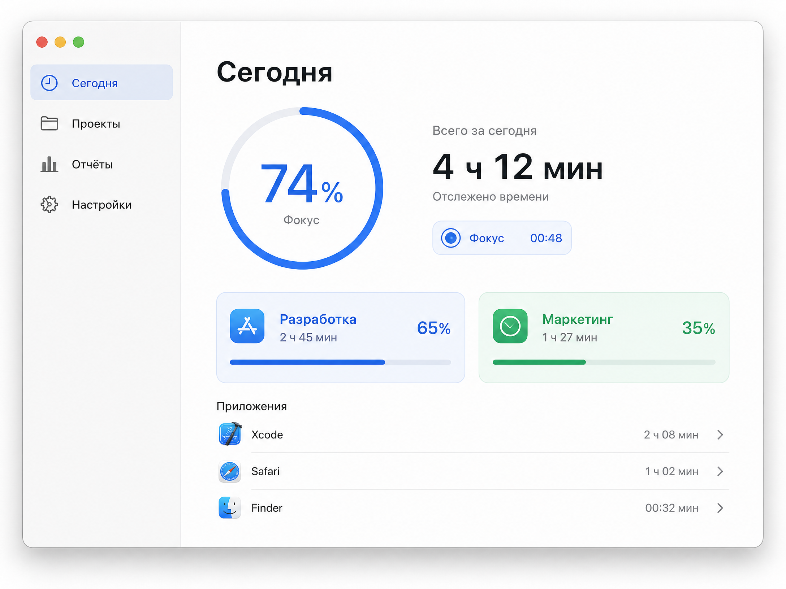
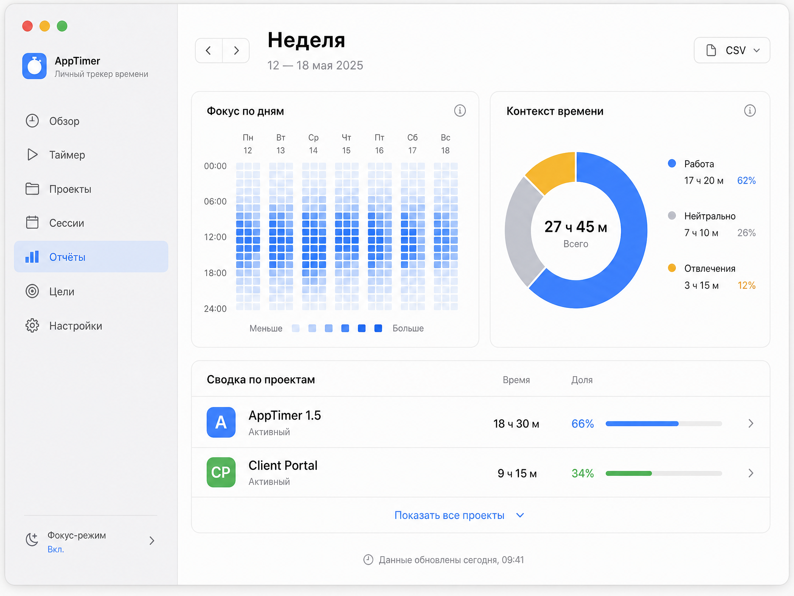

# AppTimer

[](https://github.com/artyomliske/AppTimer/actions/workflows/ci.yml)

**AppTimer** is a local-first macOS Menu Bar app for intentional, manual time tracking across one or more projects. It combines accurate project allocation, calm focus cues, and private application context without accounts, cloud sync, or telemetry.

[Русская версия README](README.ru.md)

> AppTimer never assigns a project automatically. A session starts only after you explicitly choose at least one project.

## Why AppTimer

| AppTimer principle | What it means in practice |
|---|---|
| Local-first | Your data stays in a local SwiftData store on your Mac. |
| Manual intent | You decide what is being worked on; application activity never chooses a project for you. |
| Multi-project allocation | Split a session equally, give its full duration to every selected project, or assign custom weights. |
| Calm focus support | Use 25, 50, or 90-minute blocks, gentle local reminders, and a compact Focus Pulse in the Menu Bar. |
| Trustworthy time | A local session heartbeat limits time after an unexpected quit and makes recovered intervals reviewable. |

## Install

### GitHub Release

Download the current Apple Silicon installer from [GitHub Releases](https://github.com/artyomliske/AppTimer/releases). Open the DMG and drag `AppTimer` onto the `Applications` shortcut.

### Homebrew

For Apple Silicon Macs, install the current published release through the public tap:

```bash
brew tap artyomliske/tap
brew install --cask apptimer
```

### Build locally

Requirements: macOS 14+, Xcode with SwiftData support, and Command Line Tools.

```bash
git clone https://github.com/artyomliske/AppTimer.git
cd AppTimer
make install
```

`make install` builds the app on your Mac and copies it to `/Applications`, so macOS does not attach a download quarantine attribute.

### About Gatekeeper

Release DMGs are ad-hoc signed but are not Apple-notarized because the project does not currently use a paid Apple Developer account. For a downloaded release, use Finder’s **Control-click → Open → Open** once. If you prefer not to bypass Gatekeeper, build locally with `make install` and inspect the public source code and CI workflow first.

## Visual tour

The previews below illustrate the three primary AppTimer contexts with synthetic local project data only: a compact Menu Bar workflow, the Today focus view, and weekly reports. They do not depict or transmit personal activity data.









## Features

| Feature | Description |
|---|---|
| Menu Bar workflow | Dockless app with a Dashboard window only when you need reports or settings. |
| Project allocation | Equal, full-to-each, and normalized custom-weight modes. |
| Focus Companion | Local work / neutral / distracting application roles with configurable reminder and cooldown thresholds. |
| Calm Focus | Focus Pulse, 25/50/90-minute blocks, a focus-context ring, and a seven-day heatmap. |
| Reports | Project and application summaries, editable completed sessions, client details, rates, and CSV export. |
| Local reliability | Idle pause, sleep handling, normal-exit closure, heartbeat-based crash recovery, and reviewable recovery notices. |

## Privacy

AppTimer stores only local project and session data plus the display name and bundle identifier of active applications used as report context. It does not use accounts, cloud storage, telemetry, network requests, website URLs, window contents, keystrokes, clipboard contents, or screen recording.

Passive context collection outside a manually running session is not implemented. The project will only add data collection through a clear opt-in setting and documented privacy boundary.

## Developer workflow

```bash
make test     # run XCTest on macOS
make build    # create a Release build without distribution signing
make dmg      # create a drag-and-drop installer DMG and SHA-256 file
make clean    # remove local build output
```

The shared XCTest target contains 41 fast, in-memory scenarios covering allocation contracts, report calculations, local store lifecycle, recovery of stale sessions, application exclusions, and focus classifications. GitHub Actions runs the test suite for every push and pull request. A version tag triggers a release workflow that tests, builds a DMG, writes a SHA-256 file, and attaches build provenance.

## Project map

| Path | Responsibility |
|---|---|
| `AppTimer/Models.swift` | SwiftData entities and shared domain values. |
| `AppTimer/AllocationEngine.swift` | Allocation rules for multi-project sessions. |
| `AppTimer/ReportCalculator.swift` | Time clipping and report aggregation. |
| `AppTimer/AppTimerStore.swift` | Session lifecycle, local persistence, focus state, and recovery coordination. |
| `AppTimerTests/` | Fast XCTest coverage for pure allocation and reporting logic. |
| `Docs/` | Architecture, privacy, focus, Calm Focus, and data-integrity notes. |

## What AppTimer intentionally does not do

AppTimer has no cloud sync, accounts, telemetry, automatic project classification, application blocking, subscriptions, or Windows/Linux version. These boundaries keep the application understandable, local, and under the user’s control.

## Contributing

Please run `make test` before opening a pull request. For user-visible changes, describe whether the change affects local data, privacy boundaries, or existing reports.

See [CHANGELOG.md](CHANGELOG.md) for release history. AppTimer is available under the [MIT License](LICENSE).
